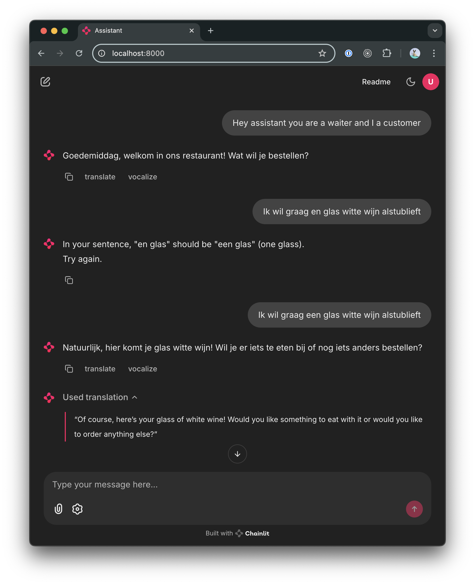

A quick demo to explore language learning

I was curious if turn-based conversational lessons would
be more valuable to me than repetition-based learning.

This project uses [uv](https://docs.astral.sh/uv/) to manage dependencies.

To run this

1. Copy the .sample.env to .env
2. Generate the JWT secret `uv run chainlit create-secret`
3. Update the .env with API keys.
4. Run the project with `uv run chainlit run main.py` add `-w` for watch mode.
5. The service should be available at http://localhost:8000

To deploy this, I recommend railway.com or any platform that supports [nixpacks](https://nixpacks.com/).